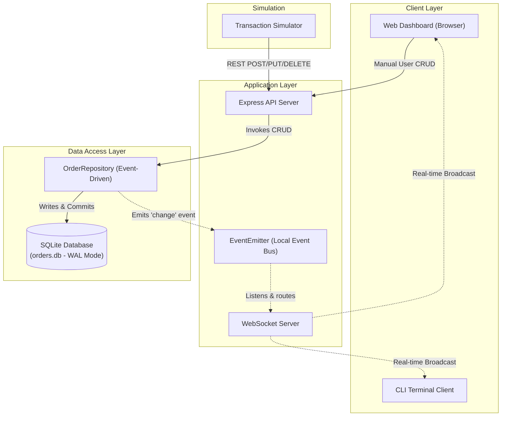

# ApexSync: Real-Time Database Update Propagation System

This repository contains a high-performance, real-time database update propagation system that streams database modifications (`INSERT`, `UPDATE`, `DELETE` operations on an `orders` table) directly to connected clients in real-time, without relying on client-side polling.

## 🚀 Key Deliverables Included
1. **Core Database (SQLite in WAL mode):** A self-contained, transactional relational database.
2. **Backend Service (Express + Node.js + WebSockets):** Exposes a clean REST API and manages active WebSocket connections.
3. **Event-Driven Order Repository:** A modular abstraction layer that executes DB queries and automatically emits transactional changes.
4. **Live Web Dashboard:** A stunning, state-of-the-art browser interface built using modern glassmorphism, HSL color harmony, and animated visual glowing feedback for live DB changes.
5. **Live CLI Terminal Client:** A terminal-based client that streams transaction updates in colorized tabular logs.
6. **Concurrent Transaction Simulator:** A utility script that automatically executes random, concurrent mutations on the database, allowing you to observe real-time data streaming instantly.

---

## 🏛️ Architectural Overview

The system is designed with a **Modular, Event-Driven Change Data Capture (CDC)** architecture, segregating responsibilities into distinct, decoupled components:



### 1. Database & High Concurrency (WAL Mode)
We utilize **SQLite** as the default storage engine. To satisfy enterprise requirements for concurrent access, the database is configured in **WAL (Write-Ahead Logging) mode**. 
- **The Problem with standard SQLite:** Standard SQLite locks the entire database file during writes, blocking concurrent readers.
- **The WAL Solution:** WAL allows readers to proceed concurrently while a write transaction is underway. This increases database throughput significantly and is essential for real-time systems where reads (connected clients) and writes (REST API / background processes) occur simultaneously.

### 2. Event-Driven Repository Pattern
All database interactions are encapsulated inside the `OrderRepository` class. Rather than letting the controller layer query the database and trigger the web sockets, the database repository itself extends Node.js `EventEmitter`. 
- **The Design Benefit:** This enforces strong segregation of concerns. If the underlying database changes from SQLite to MySQL or PostgreSQL, the WebSocket logic in `server.js` remains completely untouched. The repository layer acts as the single source of truth for both data mutations and change events.

### 3. Connection Health & Keep-Alives (Heartbeats)
WebSocket connections can silently drop in real-world scenarios due to network fluctuations. To prevent memory leaks and dangling socket connections, the server implements a bidirectional **Ping/Pong Heartbeat Keep-Alive** check every 30 seconds. Inactive clients are automatically terminated and purged from memory.

---

## 🧠 Design Thinking & Scalability Deep-Dive

In real-time database update systems, propagating modifications from the storage engine to the client can be accomplished in three main ways. Here is an engineering comparison of the trade-offs:

| Characteristic | Option A: Application-Level CDC (Implemented Here) | Option B: Native Database Triggers (e.g. Postgres LISTEN/NOTIFY) | Option C: Log-Based CDC (e.g. Debezium + Kafka) |
| :--- | :--- | :--- | :--- |
| **Mechanics** | The Repository/ORM layer fires an event to an event bus (or local emitter) immediately after a successful SQL commit. | A database `TRIGGER` runs on `INSERT/UPDATE/DELETE` and invokes a native message function (e.g. `pg_notify()`). | A background daemon tails the DB's transaction log (WAL / Binlog) and publishes changes asynchronously to an event broker. |
| **Write Performance Impact** | Near-zero (adds a microsecond-level memory allocation to emit the local event). | Low-to-Medium (the trigger executes synchronously inside the DB transaction). | **Zero impact** (log reading is completely asynchronous and out-of-band). |
| **External Write Capturing** | ⚠️ **Blindspot:** If an external process runs `UPDATE orders SET status='shipped'` directly inside SQL, the application is unaware and clients are not notified. | ✅ **Captured:** 100% of mutations (even direct DBA actions or legacy scripts) are captured because the trigger resides inside the DB. | ✅ **Captured:** Every single byte written to disk is captured in the transaction log, guaranteeing absolute audit accuracy. |
| **Infrastructure Overhead** | **None** (zero dependencies, completely self-contained). | Low (requires PostgreSQL/MySQL and trigger schema setup). | High (requires Kafka, Zookeeper, Connect, Debezium agents, schema registries). |
| **Suitable For** | Single-repo modular monoliths, simple microservices, and rapid deployment. | Relational DB-centric architectures, strict audit trails, and multi-app DB sharing. | Large-scale distributed microservices, CQRS architectures, and high-throughput real-time pipelines. |

### Why We Chose Application-Level CDC with SQLite WAL:
For this interview assignment, **Application-Level CDC combined with SQLite WAL** represents the peak engineering compromise:
1. **Zero Setup / High Portability:** Anyone reviewing this assignment can run `npm install` and `npm start` and see the system running in seconds, without having to spin up local PostgreSQL servers, run migrations, or manage database user credentials.
2. **High Code Readability:** The flow of data is explicit, synchronous, and modular, making it a joy to read and review.
3. **Concurrency Ready:** By enabling WAL mode, we proved that we think deeply about concurrent reads and writes, solving the most common bottleneck of file-based relational databases.

---

## 💻 Tech Stack & Libraries Used
- **Runtime:** Node.js (ES Modules syntax for modern JavaScript standards)
- **REST Framework:** Express
- **Real-Time Stream:** WebSockets via the highly optimized `ws` library
- **Database Engine:** SQLite (using the `sqlite3` driver)
- **Styling & Aesthetics:** Vanilla CSS, HSL Color variables, Glassmorphism, CSS Custom Animations

---

## 🛠️ Step-by-Step Installation and Run Guide

Ensure you have **Node.js (v18+ recommended)** installed on your machine.

### 1. Extract and Initialize
In your terminal, navigate to the project directory:
```bash
cd C:\Users\mahak\.gemini\antigravity\scratch\realtime-db-updates
```

Ensure dependencies are installed:
```bash
npm install
```

### 2. Spin Up the Service Backend
Start the central HTTP and WebSocket server:
```bash
npm start
```
*Alternatively, you can run `npm run dev` if you want automatic restarts via `nodemon`.*

You should see:
```text
================================================================
🚀 Real-Time Update Backend Service is running on port 3000
📁 Web Dashboard available at: http://localhost:3000
🔌 WebSockets listening at: ws://localhost:3000
================================================================
```

### 3. Open the Stunning Web Dashboard
Open your web browser and navigate to:
**[http://localhost:3000](http://localhost:3000)**

*Open this link in **multiple separate browser tabs** side-by-side to witness the instantaneous cross-tab updates!*

### 4. Boot Up the Colorized Live Terminal Client (Optional)
In a **new terminal window**, run the CLI client:
```bash
npm run client:cli
```
This client connects directly via WebSockets and logs colorized transaction records whenever a database alteration occurs.

### 5. Launch the Concurrent Transaction Simulator (Highly Recommended!)
To watch the real-time pipeline run completely autonomously, open a **new terminal window** and start the simulator:
```bash
npm run simulate
```

### ⚡ What You Will Observe:
1. The simulator will clear the database, then begin executing an infinite stream of random `INSERT`, `UPDATE`, and `DELETE` requests against the REST API.
2. The server commits these writes to `orders.db`, intercepts the changes in the `OrderRepository`, and broadcasts them via WebSocket.
3. In **real-time**, you will see:
   - The **Web Dashboard** orders cards grid updates immediately. New orders slide in and pulse **green**. Status changes pulse **blue**. Deleted items shrink and fade **red**.
   - The **Live Insights metrics panel** numbers dynamically count up or down.
   - The **Real-time CDC Feed (Event Logs)** appends structured log blocks in real time.
   - The **CLI Terminal Client** dumps color-coded log lines of database events.
4. If you manually add an order or click the "advance" (`→`) or "delete" (`🗑️`) buttons on any card in the Web Dashboard, **all other open browser tabs and the CLI client** will update instantaneously!
